# 🔄 Decentralized Agent Hand-off (The "Dabbawala" Pattern)

A resilient AI architecture that prioritizes **fault tolerance**. Instead of a central manager deciding who works, this system lets agents attempt tasks and automatically "hands off" to specialists upon failure.

> **Key Concept:** "It is better to try and fail than to never try at all."

---

## 🧐 The Problem
We have two specialized agents with strict limitations:
* **🕵️ News Reporter:** Good at text, but crashes if asked for numbers.
* **📈 Stock Broker:** Good at numbers, but cannot read news.

**Challenge:** If a user asks the News Reporter for a stock price, the agent will crash. We need a system that catches this crash and saves the request.

---

## 🏗️ Architecture: The "Fail & Recover" Loop

This project uses a **Reactive Pattern** (Try/Except Logic):

1.  **Default:** All queries go to the **News Reporter** first.
2.  **Trigger:** If the user asks for a price, the News Agent attempts it.
3.  **Trap:** A custom Python check inside the tool detects the request and raises a `ValueError`.
4.  **Recovery:** The system catches this specific error and **hands off** the query to the **Stock Broker**.

```mermaid
graph TD
    User([👤 User Query]) --> TryAgent[Attempt: News Reporter]
    
    subgraph "The Trap (Python Logic)"
    TryAgent -- "Text Query" --> Success([✅ Answer])
    TryAgent -- "Price Query" --> Error{❌ ValueError!}
    end
    
    Error -- "Exception Caught" --> HandOff[🔄 Hand-off to Broker]
    HandOff --> Broker[📈 Stock Broker]
    Broker --> Final([📢 Final Answer])
    
    style Error stroke:#ff5252,stroke-width:2px,stroke-dasharray: 5 5;
    style HandOff fill:#fff9c4,stroke:#fbc02d,stroke-width:2px;
```


---

### 🛠️ Code Logic (The "Glue")
The core of this project is the Exception Handling Block:
```
try:
    # 1. Always try the default agent first
    response = reporter_agent.run(query)
    return response

except ValueError:
    # 2. CATCH the failure (The Hand-off)
    print("❌ News Agent Failed... Handing off to Broker!")
    return stock_broker_agent.run(query)
```
---

### 🚀 Usage
1. **Clone the Repo:**
   ```Bash
   git clone [https://github.com/ergaikwadketan/Decentralized-Agent-Handoff.git](https://github.com/ergaikwadketan/Decentralized-Agent-Handoff.git)
   ```
2. **Install Dependencies:**
   ```
   pip install -r requirements.txt
   ```
3. **Run the Notebook:** Open Decentralized_Agent_Handoff_Swarm.ipynb, enter your API keys, and run the cells.
---

### 📊 Example Output
**User:** "What is Zomato trading at?"
```
🔹 User Query: 'What is Zomato trading at?'
👉 Attempting: [News Reporter Agent]...

❌ News Agent FAILED: I am a News Reporter! I cannot handle specific numbers.
🔄 HAND-OFF TRIGGERED: Calling [Stock Broker Agent] to save the day...

📢 Final Answer: Zomato is trading at 283.85 INR.
```

---
### Created By 
Ketan Dilip Gaikwad
